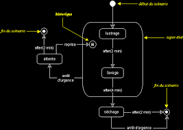

# Exercice 5

---

## Sources des images

- [Diagramme d'état-transition de uml.free.fr](http://uml.free.fr/cours/i-p20.html)
- [Diagramme d'activité de Laurent Audibert](https://laurent-audibert.developpez.com/Cours-UML/?page=diagramme-activites)

---

## Enoncé

**Tous les travaux à effectuer ci-après doivent être effectué à partir de votre réalisation de l'exercice 4.**
1. A partir de ce [template](./ressources/uc_details.xlsx), détaillez vos cas d'utilisation.
2. En vous appuyant sur l'exemple ci-dessous d'un diagramme d'état-transition, representez les différents états de la disponibilité d'un logement.
3. Réalisez un diagramme d'activité à partir de votre diagramme de cas d'utilisation en respectant les couloirs des objets ou acteurs impliquées. Vous pouvez vous appuyer sur l'exemple ci-dessous.

### Exemple diagramme d'état transition

### Exemple diagramme d'activity

