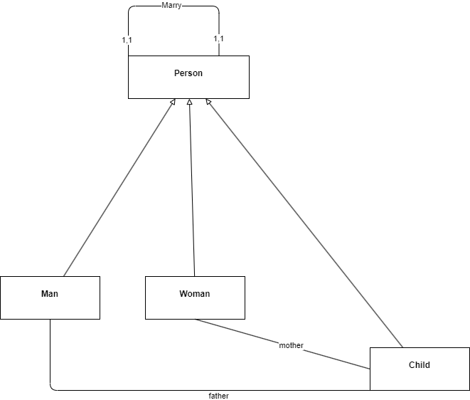

# Exercice 7

1. Modélisez à l'aide d'un diagramme de classe le système de parrainage entre un client parrain et plusieurs futures clients filleuls.

2. Proposez un autre diagramme de classe pour améliorer le diagramme de classe ci-après.
Sur la nouvelle modélisation, on veut qu'une personne puisse se marier plusieurs fois au cours de sa vie mais la polygamie reste interdite.
