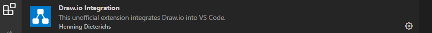

# Installation

---

## Extension draw.io VSCODE à télécharger

Ajoutez l'extension *VSCode draw.io Integration*

Pour travailler en ligne, utilisez le site [diagrams.net](https://app.diagrams.net/)

---

## AUTRES SOLUTIONS A CONNAITRE MAIS PAS BESOIN DE LES INSTALLER DANS LE CADRE DE CE COURS

- [Lien pour télécharger logiciel StarUML](https://staruml.io/download) avec sa [Documentation](https://docs.staruml.io/)
- Le site [diagrams.net](https://app.diagrams.net) pour réaliser vos diagrammes *UML*.
Le site est riche, attention de bien choisir uniquement les formes utilisées pour respecter les standards du langage *UML*.

